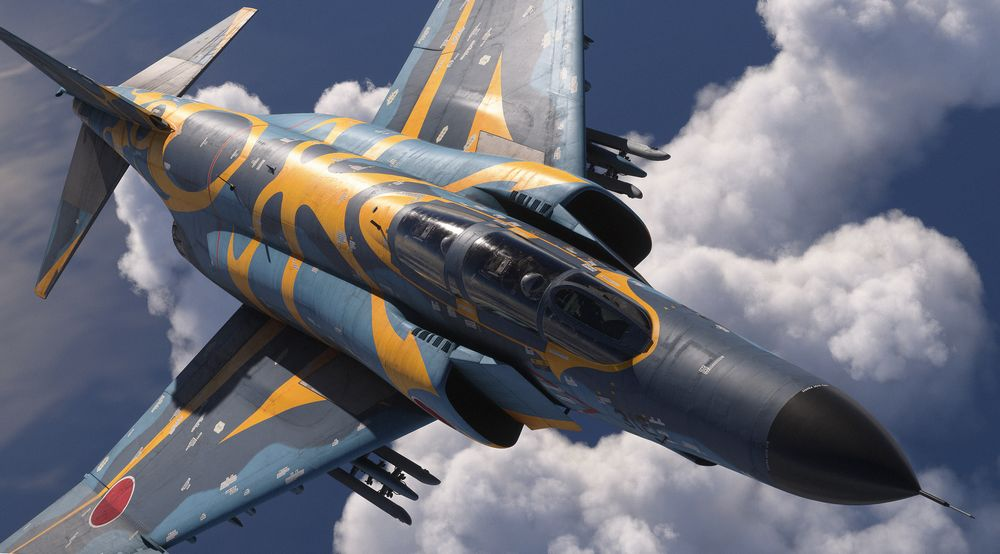

# MSFS

This chapter covers systems, settings and interfaces specific to the simulation
of the Phantom inside Microsoft Flight Simulator.

## Pre-Flight

Prior to entering the aircraft, the crew can go around the plane and inspect it
for flight readiness, check control surfaces or remove safety pins.

> 🚧 Details and picture of the pre-flight mode.

## Navigation

The Phantom carries multiple systems designed specifically for communication and
navigation with military systems.

To improve integration with MSFS and civilian systems, the aircraft was slightly
adjusted where applicable.

### Radio

The UHF Radio carried by the F-4E normally operates in the military frequency
range from 225.0 MHz to 399.95 MHz.

For MSFS the radio was adopted to instead cover the civilian range from 100 MHz
to 199.95 MHz.

### VOR/ILS

> 🚧 Details of changes. What about NDB?

## Weapons

The aircraft can be equipped with **cosmetic-only** weapons through a loadout
selection interface.

> 🚧 Details and picture of the loadout UI.

Due to engine limitations, combat related systems are currently not available.
This includes for example:

- Multiple Weapons System
- AWRU
- WRCS
- ARBCS
- AN/ALE-40
- Nose Gun
- Radar
- Pave Spike Targeting Pod
- DSCG
- RWR
